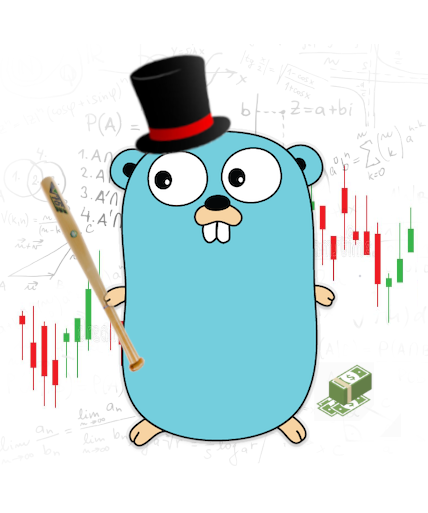

# BITA

[](https://github.com/elkopass/BITA/actions/workflows/main.yml)

Trading **B**ot based on [**I**nvest **T**inkoff **A**PI](https://github.com/Tinkoff/investAPI)



## Documentation

Our documentation is available on [GitHub Pages](https://elkopass.github.io/BITA/).

## Installation

Clone this repository first, and we are ready to go.

```shell script
$ git clone https://github.com/elkopass/BITA
```

This bot is fully configurable with environment variables 
using [envconfig](https://github.com/kelseyhightower/envconfig) library.

You can find full list of them in our 
[.env-example](cmd/trade-bot/.env-example) file.

Right before we started, obtain your Tinkoff Invest API token in 
[settings](https://www.tinkoff.ru/invest/settings/) and set it as follows: `TRADEBOT_TOKEN=<your_api_token>`.

### Using Docker

Running trade-bot in a Docker-container is a preferable way.

```shell script
$ cp cmd/trade-bot/.env-example cmd/trade-bot/.env
$ vim cmd/trade-bot/.env # make sure to reconfigure it with your own data!
$ docker-compose up --build
```

### Manual

Let's set and export env variables first:

```shell script
$ cp cmd/trade-bot/.env-example cmd/trade-bot/.env
$ vim cmd/trade-bot/.env # make sure to reconfigure it with your own data!
$ export $(grep -v '^#' cmd/trade-bot/.env | xargs)
```

After that, you can build binary and run it using go v1.16+ as follows:
```shell script
$ go build -v -o trade-bot ./cmd/trade-bot
$ ./trade-bot
``` 

## Visualization

It is very important to create alert rules on key trade actions to 
prevent possible money losses

This is why our service exports a lot of useful 
[metrics](internal/metrics/metrics.go) 
for you to configure your own monitoring.

**Check out our cool Grafana dashboard [>> here <<](https://bita.somnoynadno.ru)**

You can always download and import the latest version from 
[JSON file](.grafana/TradeBot.json) 
for your own installation. 

## Contributing

If you want to support this project, check our [contributing guideline](CONTRIBUTING.md).

## Disclaimer

The developers are NOT RESPONSIBLE for any financial losses incurred 
during the use of the trading bot.

This project is released under the Apache License.
See [LICENSE](LICENSE) for details.
